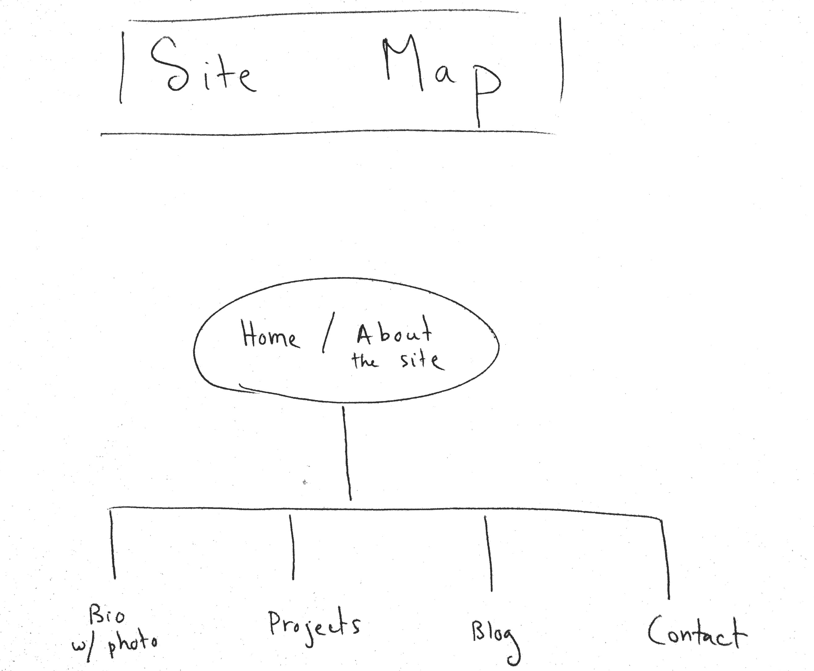

<strong>REFLECTION</strong>

<em>What are the 6 Phases of Web Design?</em>

The six phases of design follow:
(1) Information gathering – understand the mission, goals, and target audience of the organization, business, or individual.
(2) Planning – design a site map and determine necessary technologies
(3) Design – determine the appearance of the site
(4) Development – write valid HTML/CSS and other code
(5) Testing and Delivery – test, test, test, then upload site to the server with FTP (file transfer protocol)
(6) Maintenance – update page as needed. The developer can do this, or the client can update the site via a CMS, e.g., Wordpress.

<em>What is your site's primary goal or purpose? What kind of content will your site feature?</em>

My personal site shares knowledge about me (biography) and my career as a developer. I want the site to include: information about my background and relevant credentials, links to projects that complete during and after DBC, a link to my blog, and contact information.

<em>What is your target audience's interests and how do you see your site addressing them?</em>

My target audience includes friends and family (of course!), but most importantly, potential employers. My site addresses employers by offering them information about my background, education, and capabilities. The link to projects will be significant.

<em>What is the primary "action" the user should take when coming to your site? Do you want them to search for information, contact you, or see your portfolio? It's ok to have several actions at once, or different actions for different kinds of visitors.</em>

The user should first read about the purpose of the site: I plan to include a "Home" page with some introductory or "welcome" text. Next, the user will read about me by clicking to my bio (what will be the first tab on the left....we read left to right, no?).

<em>What are the main things someone should know about design and user experience? What is user experience design and why is it valuable?</em>

The article by Jacob Grube presents some worthwhile questions: Does the website have value? Is it easy and pleasant to use? User experience concerns human psychology – the affective, emotional experience of a person interacting with a computer. What a huge issue! UX, it seems to me, has to do with empathy and being able to predict and understand how humans behave, tapping into their expectations and their feelings. Something to bear in mind: the success of UX cannot be quantified and scientifically measured, other than asking users to complete surveys and then tabulating those results.

<em>Which parts of the challenge did you find tedious?</em>

I am know entirely sure if successfully integrated the image file. I have the path set-up correctly, I believe, but I do not see the image when I launch this document in my browser.....

<strong>SITE MAP</strong>

