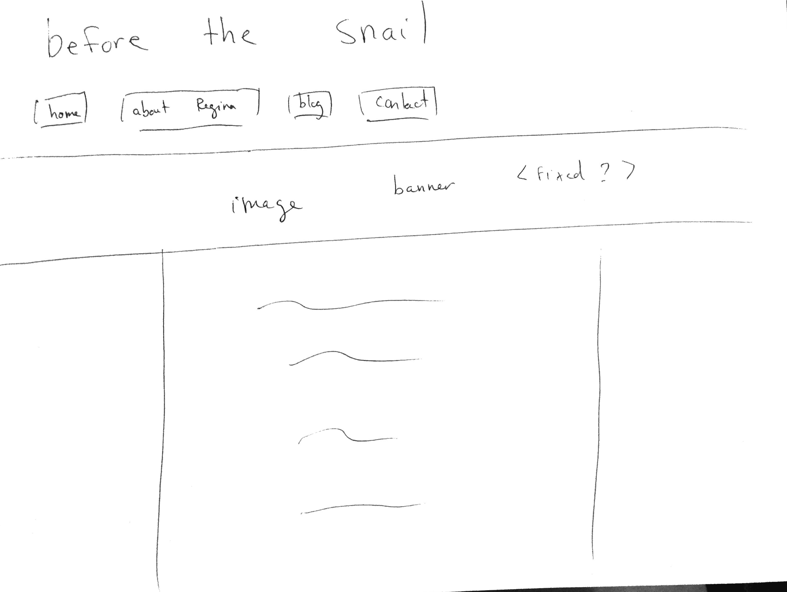
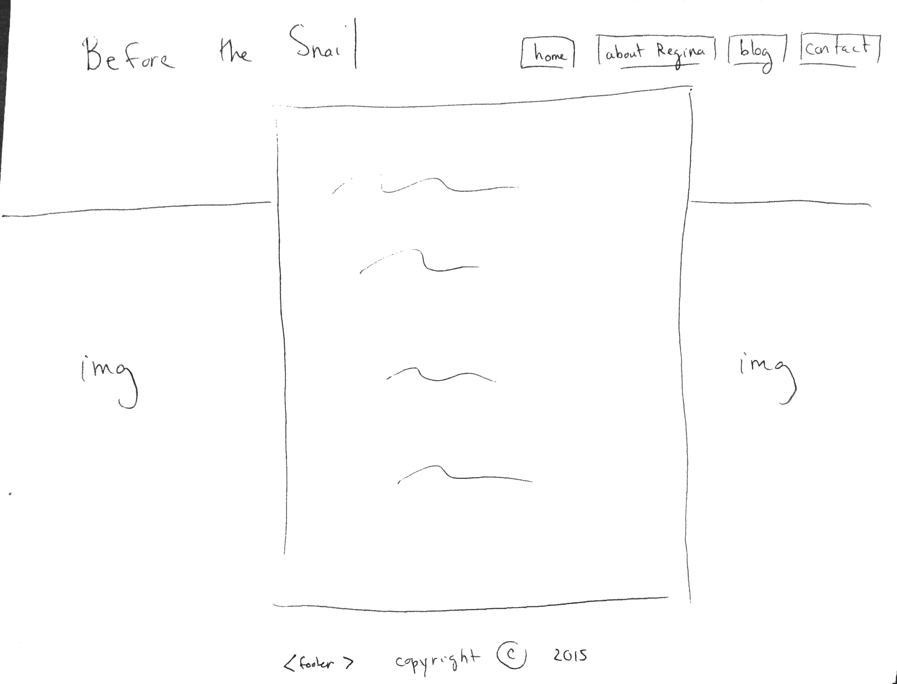

<strong>REFLECTION</strong>

<em>What is a wireframe?</em>

<em>What are the benefits of wireframing?</em>

<em>Did you enjoy wireframing your site?</em>

<em>Did you revise your wireframe or stick with your first idea?</em>

<em>What questions did you ask during this challenge? What resources did you find to help you answer them?</em>

<em>Which parts of the challenge did you enjoy and which parts did you find tedious?</em>

<strong>WIREFRAMES</strong>
<em>Number One</em>

<em>Number Two</em>

