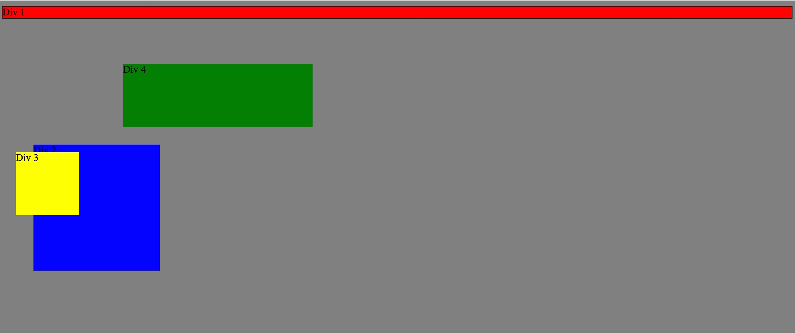
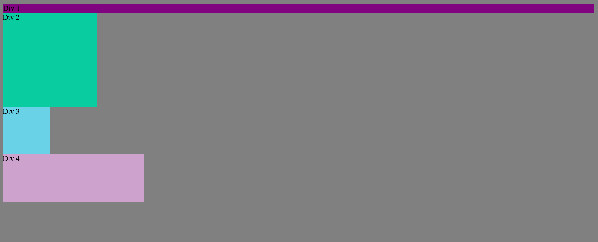
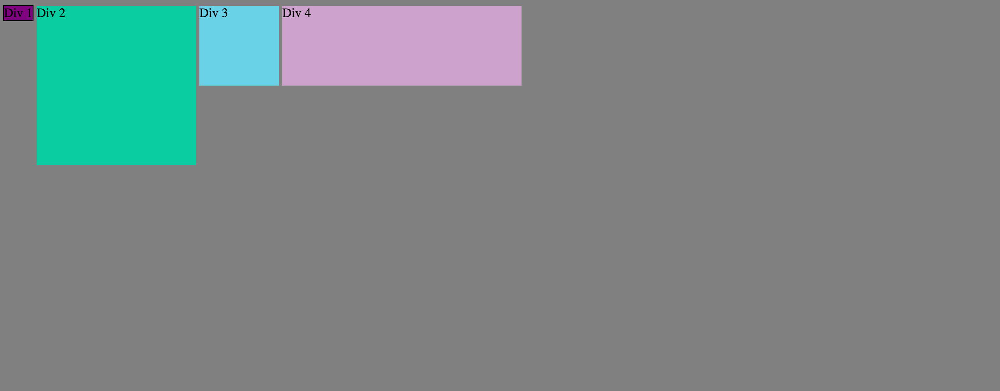
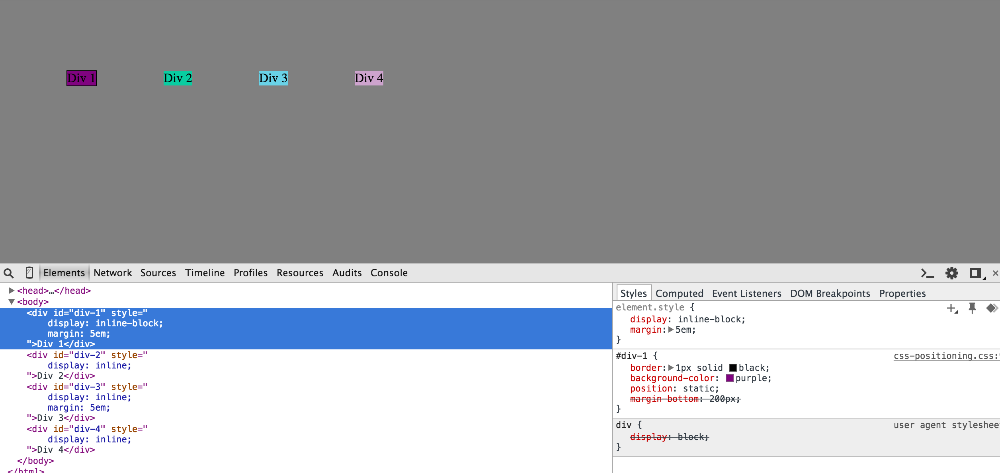
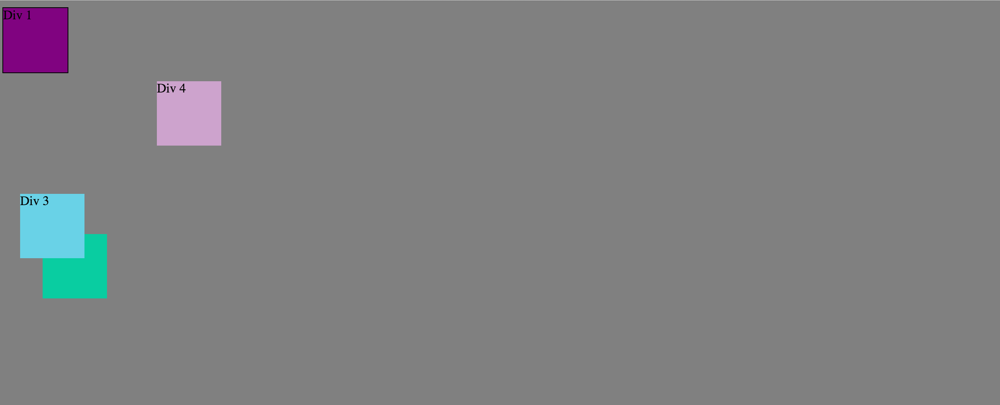
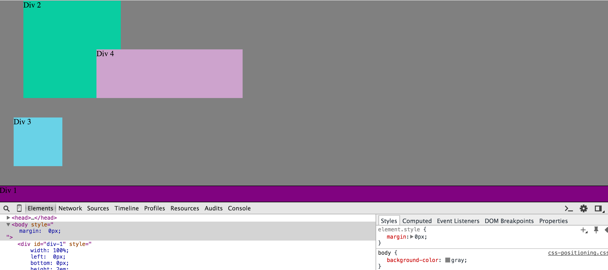
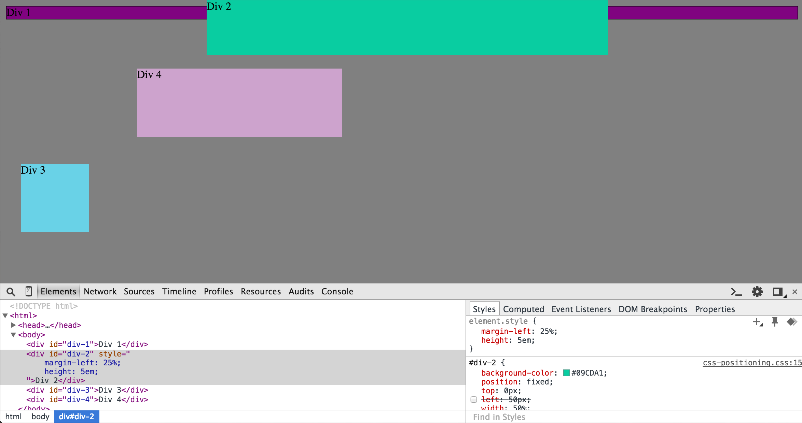
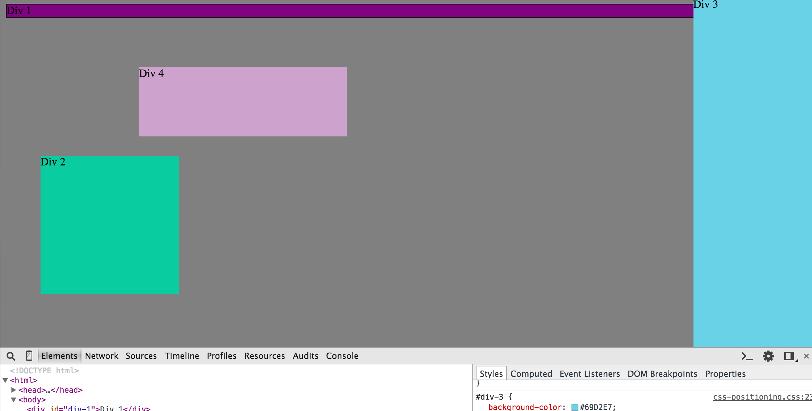
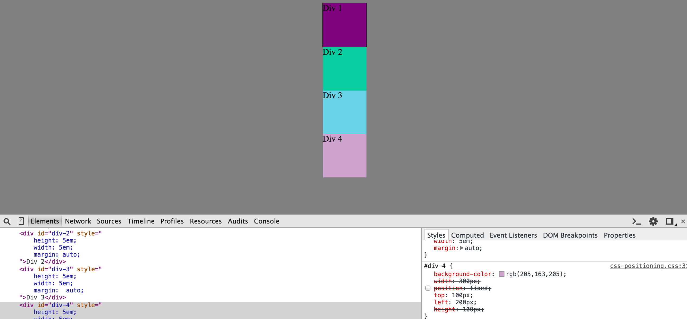

<em>How can you use Chrome's DevTools inspector to help you format or position elements?</em>
DevTools shows a live preview of the site. In the right-hand column, you can see and also modify the style elements of the page: the CSS thus transforms before your very eyes.

<em>How can you resize elements on the DOM using CSS?</em>
The most efficient way to resize an element: adjust the width and height, which can receive values in pixel, em, and percentage.

<em>What are the differences between Absolute, Fixed, Static, and Relative positioning? Which did you find easiest to use? Which was most difficult?</em>
Fixed positioning – the one that I find the most straight-forward – literally "fixes" the element to the page; the element does not move when the user scrolls up or down. Relative positioning places the element where it otherwise would have been, i.e, the element is "relative" to its original position, as it were. Absolute positioning places the element relative to its nearest parent element, i.e., it moves outside the "flow" of other elements. (The other elements may be in "flow," because of inline-block, for instance.) Static positioning is the default position – the position the element in which the element would appear in the DOM "flow."

<em>What are the differences between Margin, Border, and Padding?</em>
Margin refers to the space between elements. Padding describes the space around the element content, e.g., the space around the text inside a div. The border is the frame around the padding and element content. From outside to inside: margin - border - padding.

<em>What was your impression of this challenge overall? (love, hate, and why?)</em>
It was fun! However, I did find this challenge to be a little abstract. Will we really see such position configurations in the "real world"?

EXERCISE ONE

EXERCISE TWO

EXERCISE THREE

EXERCISE FOUR

EXERCISE FIVE

EXERCISE SIX

EXERCISE SEVEN

EXERCISE EIGHT

EXERCISE NINE
