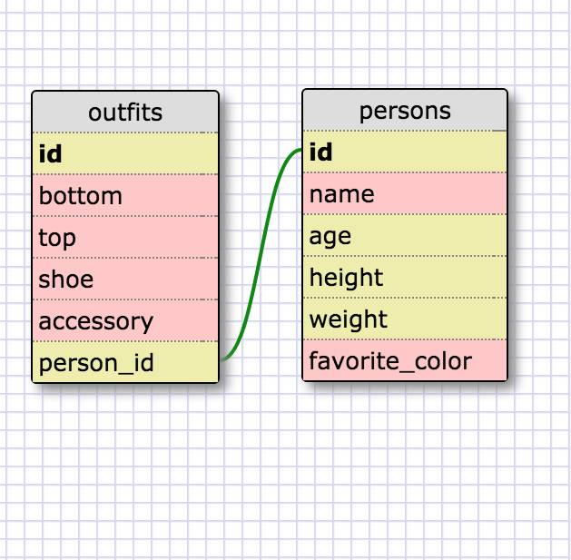

1.)
SELECT * FROM States;

2.)
SELECT * FROM Regions;

3.)
SELECT state_name FROM States;
SELECT population FROM States;
select state_name, population from States;
<!-- SQL is not case-sensitive. -->

4.)
select state_name, population from states order by population desc;

5.)
SELECT state_name FROM states WHERE region_ID=7;

6.)
SELECT state_name, population_density FROM states WHERE population_density > 50 ORDER BY population_density asc;

7.)
select state_name from states where population <1500000 AND population > 1000000;

8.)
SELECT state_name, region_id FROM states ORDER BY region_id ASC;

9.)
SELECT region_name FROM regions WHERE region_name LIKE '%Central%';

10.)
SELECT regions.region_name, states.state_name FROM regions, states WHERE states.region_id = regions.id ORDER BY region_id ASC;

<strong>What are databases for?</strong>
Databases are structured storage spaces. They can be rather sophisticated (much more so than the smaller data structures we've seen: hashes and arrays).
A relational database, for instance, can include multiple tables with rows and columns; these tables contain points of correspondence that link together data.
A database can hold anything: the contents of a bookstore, the names of students and professors, the pieces of clothing in a closet, etc., etc., etc.

<strong>What is a one-to-many relationship?</strong>
An example provides an answer. A piece of music has one composer; a composer writes one or more pieces of music.
The database contains a table for pieces of music and table for composers.
The "music" table will include a column for "composer id," which points to a specific composer in the "composer" table.
Within the "music" table, a composer id may appear multiple times.

<strong>What is a primary key? What is a foreign key? How can you determine which is which?</strong>
A primary key appears as the unique identifier for each record in a table;
it cannot change and cannot be duplicated.
A foreign key links together two tables by identifying the primary keys of another table;
it can appear multiple times in a table.

<strong>How can you select information out of a SQL database? What are some general guidelines for that?</strong>
SQL has a modest vocabulary that allows you to query data inside tables.
The commands (which are NOT case sensitive, though they look nice in uppercase) must be combined to form more precise queries.
For example, SELECT can work together with ORDER BY and ASC, which put select values of a table into ascending order.