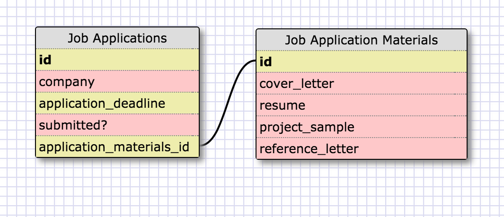
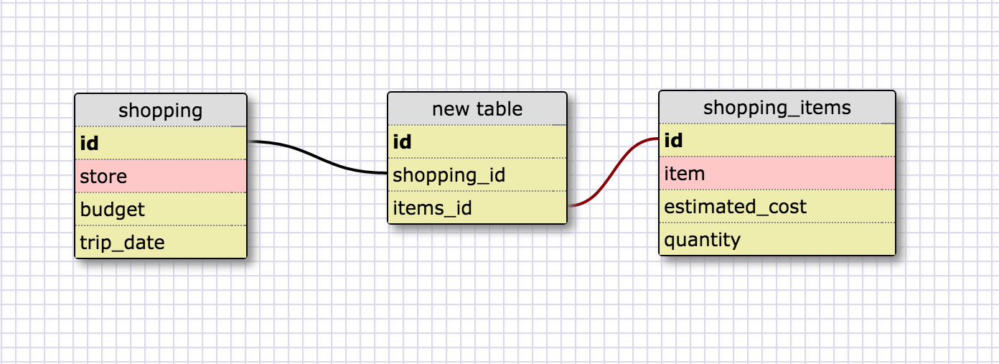

<strong>Release Two</strong>

<strong>Release Four</strong>

<strong>What is a one-to-one database?
When would you use a one-to-one database? (Think generally, not in terms of the example you created).</strong>

A one-to-one database has tables that present a single relationship.
For example, in an apartment complex with studio apartments, each
studio can house only one person; each person can live in only one studio.
You use one-to-one databases when an entry for a data type may evaluate as NULL, or when you need a table with supplemental information.
(You might need a supplemental table, if you want to streamline a table, inculding the attributes that you query most often.)
<!-- One-to-many.....An example illustrates. A candy factory (brand name) can make multiple types of chocolate bars; a chocolate bar can have only one brand name.
Thus, one data table can include the following attributes: factory name, location, and number of employees.
And the other data table can include these attributes: chocolate bar names, percentage of chocolate, cost, and the factory ID. -->

<strong>What is a many-to-many database?
When would you use a many-to-many database? (Think generally, not in terms of the example you created).</strong>

A many-to-many database contains tables that present several relationships.
For example, the performance of a piece of music requires several musicians,
and, during a concert, a musician might perform multiple pieces.
You use a many-to-many database when you need to highlight these
points of correspondence (i.e., in a "join" table).

<strong>What is confusing about database schemas? What makes sense?</strong>

I am excited about databases. I feel comfortable with these concepts, since
I have personally organized the materials of my musicological research and
other such work into tables, similar to the fundamentals of databases.
I like order. I like organization. I like these schema models.